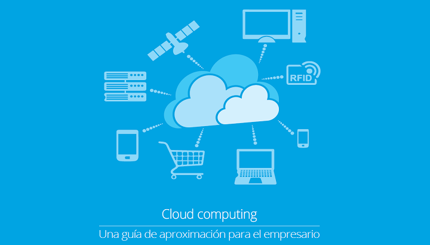

# **¿Qué es la informática en la nube?**

La informática en la nube es la prestación de servicios informáticos a través de Internet mediante un modelo de precios de pago por uso. Dicho de otro modod, es una forma de alquilar potencia de proceso y almacenamiento de un centro de datos de terceros.

### **Ventajas**

- **Confiabilidad:** las aplicaciones basadas en la nube pueden proporcionar una experiencia de usuario continua sin tiempo de inactividad perceptible aunque se produzcan errores.
 
- **Escalabilidad:** las aplicaciones en la nube se pueden escalar de dos maneras:

  - *Verticalmente:* la capacidad informática se puede aumentar si se agrega RAM o CPU adicionales a una máquina virtual.
  - *Horizontalmente:* la capacidad informática se puede aumentar si se agregan instancias de un recurso, como máquinas virtuales adicionales a la configuración.

- **Elasticidad:** las aplicaciones basadas en la nube se pueden configurar para que siempre tengan los recursos que necesitan.

- **Agilidad:** los recursos basados en la nube se pueden implementar y configurar rápidamente a medida que cambian los requisitos de la aplicación.

- **Distribución geográfica:** las aplicaciones y los datos se pueden implementar en centros de datos regionales de todo el mundo, lo que garantiza que los clientes siempre tendrán el mejor rendimiento de su región.

- **Recuperación ante desastres:** al usar los servicios de copia de seguridad basados en la nube, la replicación de datos y la distribución geográfica, podrá implementar las aplicaciones con la seguridad de saber que los datos están protegidos en caso de que se produzca un desastre.

