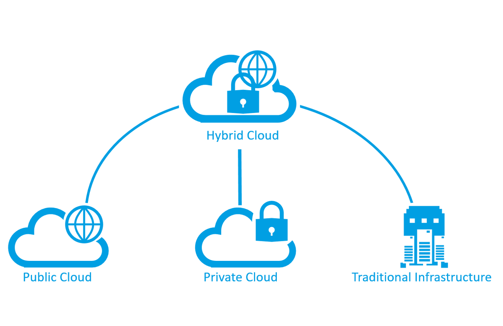

# **¿Qué son la nube pública, provada e híbrida**

Hay tres modelos de implementación para la informática en la nube: nube pública, nube privada y nube híbrida. Cada modelo de implementación tiene distintos aspectos que debe tener en cuenta a la hora de migrar a la nube.

|**Modelo de implementación**| **Descripción** |
|------------|----------|
| **Nube pública** | Los servicios se ofrecen a través de la red Internet pública y están disponibles para cualquiera que quiera comprarlos. Los recursos de nube como los servidores y el almacenamiento son propiedad de un proveedor de servicios en la nube de terceros, que los explota y distribuye a través de Internet. |
|**Nube privada** |   Los recursos informáticos son de uso exclusivo de los usuarios de una empresa u organización. Una nube privada puede estar ubicada físicamente en el centro de datos local de la organización. También la puede hospedar un proveedor de servicios de terceros.|
|**Nube híbrida** | Este entorno informático combina una nube pública y una nube privada, lo que permite compartir datos y aplicaciones entre ellas. |

